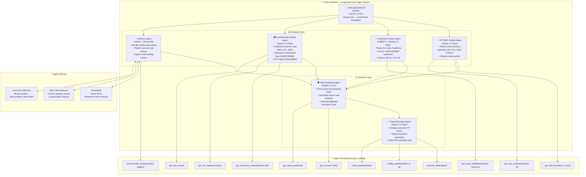
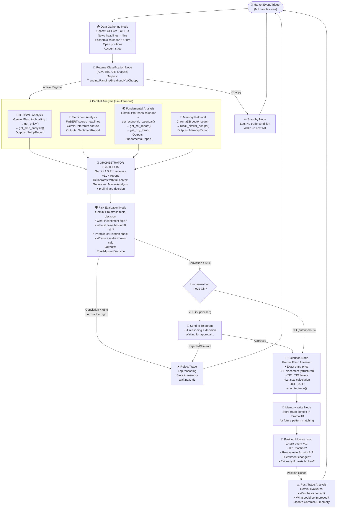

# 🧠 AI Brain Architecture — The Quant-First Hybrid Stack

> **The Quant-First Hybrid Advantage:** Pure quantitative bots fail when context changes (news, macro shifts). Pure LLM agents hallucinate and struggle with precise math. This system uses a **Quant-First Hybrid Stack**: hard mathematical algorithms filter the noise and find exact setups (Quant), and then a team of specialized AI agents read the market context to approve or reject the trade (Hybrid).

---

## THE CORE PROBLEM WITH RULE-BASED SYSTEMS

```
❌ RULE-BASED BOT:
   "IF ADX > 25 AND OB touched AND Kill Zone → BUY"
   → Blind. Mechanical. Same action in every context.
   → Cannot read that the USD just got crushed by CPI data.
   → Cannot see that this same setup FAILED 8 times last week.
   → Cannot reason: "Yes the setup looks perfect, BUT the DXY
     is making an ATH and I should wait for confirmation."

✅ AI AGENT BRAIN:
   "I see the OB setup. Let me also check: What did NFP say?
   What is institutional sentiment on the DXY? Did this pattern
   work on Gold last Tuesday in similar conditions? The technicals
   are perfect (85/100), but news sentiment is bearish on USD.
   Combined — I have 78% conviction. Risk 0.8% (slightly reduced).
   Entry on next M5 close above OB midpoint only."
   → Reads context. Reasons. Remembers. Adapts. Decides.
```

---

## SECTION 1 — THE AI BRAIN: MULTI-AGENT LangGraph SYSTEM

The brain is not a single AI. It is a **team of 6 specialized AI sub-agents** that collaborate, challenge each other, and reach a consensus decision — just like a trading desk.



---

## SECTION 2 — THE PRIMARY AI: GOOGLE GEMINI

### Why Gemini?

| Capability | Why It Matters for Trading |
|-----------|---------------------------|
| **2M token context window** | Can process 108 data streams (all symbols × all TFs) in a single prompt |
| **Native function/tool calling** | Calls MT5, news APIs, calendar APIs natively — no hacks |
| **Multimodal (text + images)** | Can literally *look* at a chart image and analyze it like a human |
| **Speed** | Gemini Flash: < 1 second response time — critical for M1 trading |
| **Structured JSON output** | Returns trade decisions as clean, parseable JSON |
| **Reasoning (thinking mode)** | Extended thinking traces through complex market scenarios step-by-step |
| **Grounding with Google Search** | Can search live financial news as part of its reasoning |

### Model Usage by Agent

| Agent | Model | Why This Model |
|-------|-------|---------------|
| **Orchestrator** | `gemini-1.5-pro` | Highest reasoning quality — coordinates all agents |
| **ICT/SMC Analyst** | `gemini-1.5-flash` | Fast chart analysis, low latency |
| **Sentiment Analyst** | `FinBERT` + `gemini-1.5-flash` | FinBERT for raw scoring, Gemini for contextual interpretation |
| **Fundamental Analyst** | `gemini-1.5-pro` | Complex macro reasoning (Fed policy, CPI impact) |
| **Memory Agent** | `gemini-1.5-flash` + `ChromaDB` | RAG retrieval, pattern matching |
| **Risk Evaluator** | `gemini-1.5-pro` | Critical decisions — highest quality model |
| **Execution Agent** | `gemini-1.5-flash` | Speed critical at execution moment |

> **Fallback:** If Gemini API is unavailable → system falls back to `GPT-4o` (OpenAI) via the same LangChain tool interface. Zero code change required.

---

## SECTION 3 — HOW THE AGENT THINKS (Step-by-Step Reasoning)

### The Human Trader Thought Process vs. Agent Thought Process

```
HUMAN TRADER THINKS:
  1. "Let me check the daily chart first... ok EURUSD is bullish"
  2. "Drop to H4... there's a nice OB here that hasn't been touched"
  3. "What's happening with news? Let me check ForexFactory..."
  4. "NFP was weak → USD weakening → supports my EURUSD buy"
  5. "Last time I saw this exact setup was March 12th — it worked"
  6. "Risk-off or risk-on? EUR sentiment looks positive today"
  7. "Price is in London Kill Zone, entering the OB now"
  8. "I'll risk 1% with SL below the OB, target the daily high"
  9. "But wait — FOMC in 2 hours. I'll reduce size to 0.5%"
  10. → EXECUTE: Buy EURUSD 0.2 lots

AI AGENT THINKS (identically):
  [ICT Analyst]      → "D1 bullish BOS, H4 OB at 1.08200–1.08450, FVG inside. Score: 85/100"
  [Sentiment Agent]  → "USD news sentiment: NEGATIVE (NFP miss). EUR sentiment: NEUTRAL. Net: Bullish EURUSD"
  [Fundamental Agent]→ "Fed pausing hikes. ECB hawkish. DXY trending down. Macro: BULLISH EURUSD"
  [Memory Agent]     → "Found 7 similar OB+weak-NFP setups on EURUSD. Win rate: 71%. Avg RR: 2.3"
  [Orchestrator]     → DELIBERATION: "Technical: excellent. Sentiment: supportive. Fundamental: aligned.
                        Memory: historically profitable. BUT — FOMC in 2 hours = reduce size"
  [Risk Evaluator]   → "Conviction: 79%. Adjusted risk: 0.7% (FOMC buffer). SL: 1.08150. TP1: 1.08800"
  [Execution Agent]  → TOOL CALL: execute_trade(EURUSD, BUY, 0.14 lots, sl=1.08150, tp=1.08800)
```

---

## SECTION 4 — LANGGRAPH AGENT WORKFLOW

LangGraph manages the entire reasoning workflow as a **stateful directed graph**. Each node is an agent. Edges are conditional — the agent decides which path to take.



---

## SECTION 5 — THE 6 AI AGENTS IN DETAIL

### Agent 1 — 📐 ICT/SMC Analyst Agent

**Model:** `gemini-1.5-flash`  
**Role:** The "chart reading" specialist

**System Prompt:**
```
You are an elite ICT (Inner Circle Trader) and Smart Money Concepts 
analyst with 15 years of institutional trading experience. You 
specialize in reading market structure, identifying Order Blocks, 
Fair Value Gaps, Liquidity pools, and BOS/CHoCH patterns.

You have access to the following tools:
- get_ohlcv(symbol, timeframe, count)
- get_smc_analysis(symbol, timeframe)

Your task: Analyze the provided symbol across all relevant timeframes 
(D1, H4, H1, M15, M5) using a top-down approach. Output a structured 
SetupReport with quality score (0-100) and detailed reasoning.

Be precise. Be institutional. If the setup is not clean, say so.
```

**Example Reasoning Output:**
```json
{
  "agent": "ICT_SMC_ANALYST",
  "symbol": "EURUSD",
  "setup_quality": 82,
  "direction": "BUY",
  "reasoning": [
    "D1: Strong bullish trend. Last BOS at 1.0780. Price in discount zone — confirmed buy bias",
    "H4: Clean bullish OB at 1.0820–1.0845 (formed 3 candles ago, unmitigated)",
    "H1: Price swept SSL at 1.0815 — stop hunt complete. CHoCH confirmed at 1.0828",
    "M15: FVG between 1.0825 and 1.0832. Price approaching from above",
    "M5: MSS to bullish confirmed. Entry zone: FVG at 1.0826–1.0830",
    "SL recommendation: 1.0813 (below H1 OB low + 2 pip buffer)",
    "TP1: 1.0870 (previous H1 high), TP2: 1.0920 (D1 BSL pool)"
  ],
  "setup_type": "OB_FVG_SWEEP_CONFLUENCE",
  "invalidation": "Candle close below 1.0815"
}
```

---

### Agent 2 — 📰 Sentiment Analyst Agent

**Models:** `FinBERT` (ProsusAI/finbert) + `gemini-1.5-flash`  
**Role:** The "news reader" — understands market mood

**Dual-Layer Process:**
```
LAYER 1 — FinBERT (fast, specialized NLP):
  Input: Last 20 news headlines mentioning USD, EUR, EURUSD
  Output: {positive: 0.72, neutral: 0.18, negative: 0.10}
  → Raw sentiment score: +0.62 (bullish for EUR, bearish for USD)

LAYER 2 — Gemini Flash (contextual interpretation):
  Input: FinBERT scores + actual headlines + economic context
  Prompt: "Given these sentiment scores and headlines, what is the 
           likely institutional bias on EURUSD for the next 4 hours?
           Consider: Is this news already priced in? Are markets 
           reacting logically? Any contradictions?"
  Output: Nuanced sentiment interpretation
```

**News Sources Used:**

| Source | API | Data Type |
|--------|-----|-----------|
| **Reuters / Bloomberg** | Scraped or NewsAPI | Breaking financial news |
| **ForexLive** | RSS Feed | Forex-specific news |
| **Investing.com** | RapidAPI | Economic data releases |
| **Twitter/X (Forex accounts)** | Twitter API v2 | Retail sentiment |
| **Reddit r/Forex** | Reddit API | Retail bias (contrarian indicator) |
| **CNBC / MarketWatch** | NewsAPI.org | Macro financial news |

**Example Sentiment Output:**
```json
{
  "agent": "SENTIMENT_ANALYST",
  "symbol": "EURUSD",
  "timeframe": "4H",
  "finbert_scores": {"positive": 0.68, "neutral": 0.22, "negative": 0.10},
  "net_sentiment": 0.58,
  "sentiment_label": "BULLISH_EUR",
  "key_headlines": [
    "Fed Powell: Rate cuts still on table for Q3 — USD weakened",
    "ECB holds rates, Lagarde signals no cuts until inflation falls",
    "US Jobless Claims beat expectations — slight USD recovery"
  ],
  "gemini_interpretation": "The dominant theme is USD weakness from Fed dovish signals, offset slightly by stronger jobless claims. ECB hawkishness adds to EUR strength. Net institutional sentiment favors EUR longs. This narrative likely has 12–24 hours of shelf life before being priced in.",
  "sentiment_strength": "MODERATE",
  "already_priced_in": false,
  "contrarian_signal": false
}
```

---

### Agent 3 — 🌍 Fundamental Analyst Agent

**Model:** `gemini-1.5-pro`  
**Role:** The "macro economist" — reads the big picture

**Data Sources It Analyzes:**

| Data | Source | Frequency |
|------|--------|-----------|
| **Economic Calendar** | ForexFactory scraper | Real-time |
| **COT Report** (Commitment of Traders) | CFTC.gov | Weekly |
| **DXY (Dollar Index) trend** | MT5 data feed | Real-time |
| **Central Bank statements** | Fed/ECB/BoE official sites | On release |
| **Interest rate differentials** | Calculated from current rates | Daily |
| **GDP, CPI, NFP releases** | Investing.com API | On release |

**Example Output:**
```json
{
  "agent": "FUNDAMENTAL_ANALYST",
  "macro_bias_eurusd": "BULLISH",
  "confidence": 0.74,
  "key_factors": [
    "Fed on pause: real rate differential narrowing → USD pressure",
    "ECB still hawkish: 2 more hikes expected → EUR supportive",
    "COT: Large speculators net LONG EUR (+45,234 contracts, increasing)",
    "DXY: Below 200-period EMA, making lower lows — structurally weak"
  ],
  "upcoming_risks": [
    {"event": "FOMC Minutes", "time": "18:00 UTC", "impact": "HIGH", "action": "reduce_size"},
    {"event": "ECB Schnabel Speech", "time": "14:30 UTC", "impact": "MEDIUM", "action": "monitor"}
  ],
  "risk_environment": "RISK_ON",
  "recommendation": "Fundamental analysis SUPPORTS the bullish EURUSD thesis. However, FOMC Minutes at 18:00 UTC is a risk — suggest reduced lot size.",
  "interest_rate_differential": "+0.75% (EUR favorable)"
}
```

---

### Agent 4 — 🧠 Memory Agent (RAG — Retrieval Augmented Generation)

**Model:** `gemini-1.5-flash` + `ChromaDB` + `text-embedding-004`  
**Role:** The agent's "long-term memory" — learns from every trade

**How Memory Works:**

```
WRITE (after every trade closes):
  → Embed trade context as a vector:
     {symbol, regime, setup_type, sentiment, fundamental_bias,
      entry_price, outcome, pnl, what_worked, what_failed}
  → Store in ChromaDB with metadata tags

READ (before every new trade):
  → Embed current setup context as query vector
  → ChromaDB similarity search: "Find 5 most similar past setups"
  → Return: historical win rate, avg RR, failure patterns, lessons

EXAMPLE:
  Query: "EURUSD + OB+FVG + London Kill Zone + bullish sentiment + trending"
  Result: "Found 12 similar setups. Win rate: 75%. Avg RR: 2.1.
           3 failures all occurred on high USD volatility days (NFP).
           Best entries: FVG 50% level, not OB top."
```

**The Agent LEARNS and IMPROVES:** After 100 trades, the memory database contains rich pattern data. After 1,000 trades, the agent has developed its own "playbook" based on actual live performance — not just rules, but lived experience.

---

### Agent 5 — 🛡️ Risk Evaluator Agent (The Hybrid Confidence Scorer)

**Model:** `gemini-1.5-pro`  
**Role:** The "devil's advocate" — calculates the final Hybrid Confidence Score and challenges the trade.

**The Hybrid Confidence Score Formula:**
The final score bridges the Quant engine and the AI reasoning engine.

```text
[QUANTITATIVE LAYER]
Technical Setup Quality:    × 0.35  (Hard math: ICT/SMC, Indicators, Liquidity)
Risk Environment:           × 0.10  (ATR, spread, volume metrics)

[AI / SEMANTIC LAYER]
Sentiment Alignment:        × 0.20  (FinBERT + Gemini headline analysis)
Fundamental Alignment:      × 0.20  (Macro economic report reasoning)
Memory/Historical Rate:     × 0.15  (ChromaDB pattern match win-rate)

= FINAL HYBRID CONFIDENCE SCORE (0–100)

Execution Thresholds:
≥ 80: High Conviction → Full size (1.0% risk)
70–79: Moderate Conviction → Reduced size (0.5% risk)
< 70: REJECT TRADE (Not enough confluence between Quant and AI)
```

---

### Agent 6 — ⚡ Trade Execution Agent

**Model:** `gemini-1.5-flash` (speed critical)  
**Role:** Translates approved decision into precise MT5 orders

- Calculates exact SL in pips, verifies RR ratio
- Double-checks lot size vs margin requirements
- Monitors slippage — cancels if > 2 pips
- Writes complete human-readable reasoning to journal

---

## SECTION 6 — COMPLETE AI BRAIN TECH STACK

### Core AI & LLM Stack

| Component | Technology | Version | Cost |
|-----------|-----------|---------|------|
| **Primary LLM** | Google Gemini 1.5 Pro | Latest | ~$3.50/1M tokens |
| **Fast LLM** | Google Gemini 1.5 Flash | Latest | ~$0.075/1M tokens |
| **Fallback LLM** | OpenAI GPT-4o | Latest | ~$5.00/1M tokens |
| **Financial NLP** | FinBERT (ProsusAI) | HuggingFace | Free (runs locally) |
| **Text Embeddings** | Google text-embedding-004 | Latest | ~$0.025/1M tokens |
| **Agent Framework** | LangGraph | `0.1+` | Free (open source) |
| **LLM Interface** | LangChain | `0.2+` | Free (open source) |
| **Observability** | LangSmith | Latest | Free tier available |

### Memory & Vector Database

| Component | Technology | Purpose |
|-----------|-----------|---------|
| **Vector Store** | ChromaDB | Persistent semantic trade memory |
| **Embeddings** | text-embedding-004 | Convert trade context → searchable vectors |
| **Short-term** | LangGraph state | Current session context |
| **Long-term** | ChromaDB + SQLite | All trades + outcomes + lessons learned |

### News & Sentiment Data

| Source | Library / API | Cost |
|--------|--------------|------|
| **NewsAPI.org** | `newsapi-python` | Free (100 req/day) |
| **ForexLive RSS** | `feedparser` | Free |
| **ForexFactory Calendar** | `beautifulsoup4` | Free |
| **Twitter/X** | `tweepy` | Free basic tier |
| **Reddit r/Forex** | `praw` | Free |
| **COT Report** | `requests` → CFTC.gov | Free |

---

## SECTION 7 — THE AGENT'S ACTUAL THOUGHT PROCESS (Full Example)

**Scenario:** 08:12 UTC, London Kill Zone. XAUUSD (Gold).

```
══════════════════════════════════════════════════════════
🤖 AI TRADING AGENT — DELIBERATION LOG
Symbol: XAUUSD | Time: 08:12 UTC | Session: LONDON KZ
══════════════════════════════════════════════════════════

[ICT ANALYST]      → D1 bullish BOS at $2,285. H4 OB at $2,308–$2,318.
                     H1 SSL swept at $2,305. CHoCH at $2,310. M15 FVG
                     at $2,309–$2,313 inside H4 OB. SETUP: 88/100 BUY

[SENTIMENT AGENT]  → 18 headlines analyzed. FinBERT: {pos:0.74, neg:0.08}
                     Key: "Fed signals uncertainty → Gold rallies"
                          "Middle East tensions → safe haven demand"
                          "DXY retreats from weekly high"
                     Gemini: "Dominant USD weakness + geopolitical bid.
                     Net: BULLISH GOLD. Not yet fully priced in."

[FUNDAMENTAL AGENT]→ No high-impact news next 4 hours ✅
                     CPI yesterday: MISS → USD bearish ✅
                     COT: Large specs NET LONG gold +142,890 contracts
                     (3-year high) ✅ DXY: Below 200 EMA, LH+LL ✅
                     MACRO: BULLISH GOLD | Confidence: 81%

[MEMORY AGENT]     → ChromaDB query: "XAUUSD+OB+FVG+SSL_SWEEP+London"
                     Found: 9 similar setups
                     Win rate: 77.8% | Avg RR: 2.4
                     Lesson: "Enter at FVG midpoint $2,311, not OB top"
                     MEMORY SIGNAL: POSITIVE ✅

[ORCHESTRATOR]     → ALL 4 DIMENSIONS ALIGNED. No conflicts.
                     Strong BUY candidate. → Risk Evaluator...

[RISK EVALUATOR]   → Conviction: (88×0.35)+(85×0.20)+(81×0.20)+(78×0.15)+(80×0.10)
                              = 30.8 + 17.0 + 16.2 + 11.7 + 8.0 = 83.7
                     Portfolio: 0.8% exposure (EURUSD) — within limits ✅
                     Williams speech in 6hrs — acceptable ✅
                     DECISION: ✅ APPROVED | Risk: 1% | Lots: 0.11

[EXECUTION AGENT]  → Entry: $2,311.0 (FVG midpoint — memory applied ✅)
                     SL: $2,302.0 | TP1: $2,335 (RR 2.7) | TP2: $2,358 (RR 5.2)
                     MT5 ORDER SENT → FILLED @ $2,311.2 (0.2 pip slip ✅)

Telegram: "🟡 BUY GOLD @ $2,311.2 | Conf: 83.7% | Risk: $100
           Regime: TRENDING | Session: LONDON KILL ZONE
           Sentiment: BULLISH (geopolitical + USD weakness)
           Memory: 77.8% WR on 9 similar past setups"

Memory written to ChromaDB ✅ | Journal logged ✅ | Dashboard updated ✅
══════════════════════════════════════════════════════════
```

---

## SECTION 8 — THE FUNDAMENTAL DIFFERENCE (FINAL SUMMARY)

| Capability | Rule-Based Bot | This AI Agent |
|-----------|---------------|---------------|
| **Chart reading** | Mechanical indicators | Gemini reasons like a human analyst |
| **News awareness** | ❌ None | ✅ FinBERT + Gemini reads ALL news real-time |
| **Macro understanding** | ❌ None | ✅ Dedicated Fundamental Agent (Fed, COT, DXY) |
| **Learning from past** | ❌ None | ✅ ChromaDB memory — learns from every trade |
| **Conflict resolution** | ❌ None | ✅ Orchestrator debates conflicting signals |
| **Conviction sizing** | Fixed % always | ✅ Scales 0.5%→1.25% based on conviction |
| **Explanation** | ❌ None | ✅ Full written reasoning for every decision |
| **Adaptability** | Rigid rules | ✅ Adapts in real-time to any condition |
| **Observability** | Basic logs | ✅ LangSmith traces every agent's thought |
| **Human oversight** | All or nothing | ✅ Telegram approve/reject toggle |

> **This is not a trading bot. This is a virtual trading analyst team — 6 specialized AI agents working 24/7, learning from every trade, reasoning like a senior institutional trader.**
