# 🤖 AI Institutional Trading Agent — Detailed Architecture & Flow

---

## 1. System Overview — 30,000 Foot View

The system is built as a **layered, event-driven architecture** where each layer has one job, feeds the next, and can fail independently without crashing the whole system.

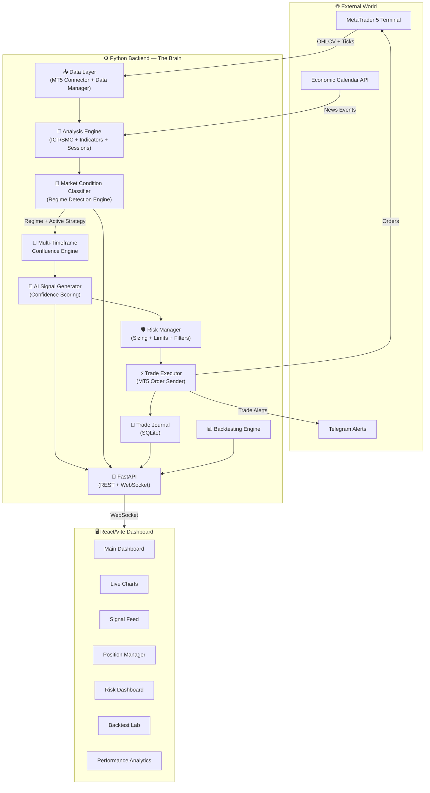

---

## 2. Data Layer — The Foundation

The data layer is the **heartbeat** of the system. Every 60 seconds (on M1 candle close), it refreshes all data.

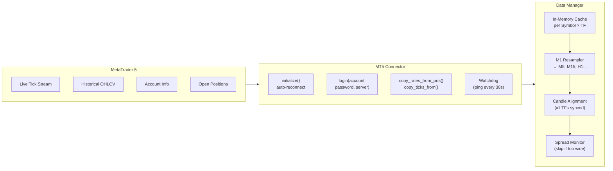

### Timeframe Hierarchy

| Timeframe | Purpose | Update Frequency |
|-----------|---------|-----------------|
| **MN (Monthly)** | Macro bias, major liquidity pools | Once/month |
| **W1 (Weekly)** | Intermediate structure, premium/discount | Once/week |
| **D1 (Daily)** | HTF Order Blocks, PDH/PDL, killzone prep | Once/day |
| **H4** | Trend direction, major OBs, FVGs | Every 4 hours |
| **H1** | BOS/CHoCH confirmation, entry context | Every hour |
| **M15** | Execution timeframe, refined OBs | Every 15 min |
| **M5** | Entry precision, MSS confirmation | Every 5 min |
| **M1** | Tick-level entry, SL placement | Every minute |

---

## 3. Analysis Engine — The ICT/SMC Brain

This is the most critical layer. It processes raw OHLCV data into **institutional trading constructs**.

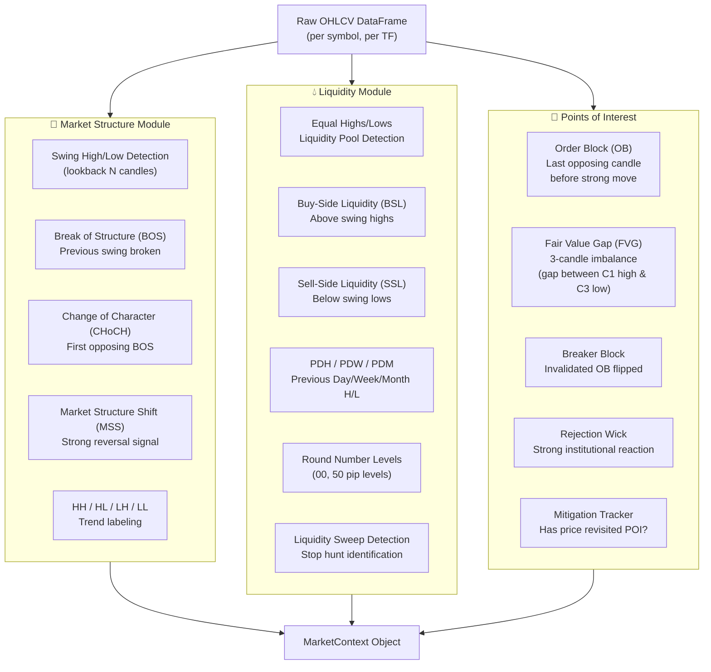

### How Key Concepts Are Calculated

#### Order Block (OB) Detection
```
For BULLISH OB:
  → Find last DOWN candle (close < open) 
  → Before a significant upward move (≥ X ATR)
  → That down candle IS the Order Block
  → Zone = [OB low, OB high]
  → Valid until price closes below OB low

For BEARISH OB:
  → Find last UP candle (close > open)
  → Before a significant downward move (≥ X ATR)
  → Zone = [OB low, OB high]
  → Valid until price closes above OB high
```

#### Fair Value Gap (FVG) Detection
```
3 consecutive candles where:
  BULLISH FVG: candle[i-2].high < candle[i].low
  → Imbalance between candle 1 top and candle 3 bottom
  → Price tends to "fill" this gap (rebalance)

  BEARISH FVG: candle[i-2].low > candle[i].high
  → Imbalance is a premium zone to sell into
```

#### Break of Structure (BOS) vs Change of Character (CHoCH)
```
In UPTREND (HH + HL pattern):
  BOS = price breaks above previous HH → continuation
  CHoCH = price breaks below last HL → reversal signal

In DOWNTREND (LH + LL pattern):
  BOS = price breaks below previous LL → continuation
  CHoCH = price breaks above last LH → reversal signal
```

---

## 3B. 🧭 Market Condition Classifier — Trading ALL Market Regimes

This is the **adaptive intelligence core** of the agent. Before generating any signal, the system must first answer: *"What kind of market are we in RIGHT NOW?"* — because strategies that work in trending markets **destroy capital** in ranging markets, and vice versa.

The classifier runs on every M1 candle close and outputs a **Market Regime** label. Each regime activates a dedicated strategy engine with its own entry logic, SL/TP structure, and risk parameters.

### The 5 Market Regimes

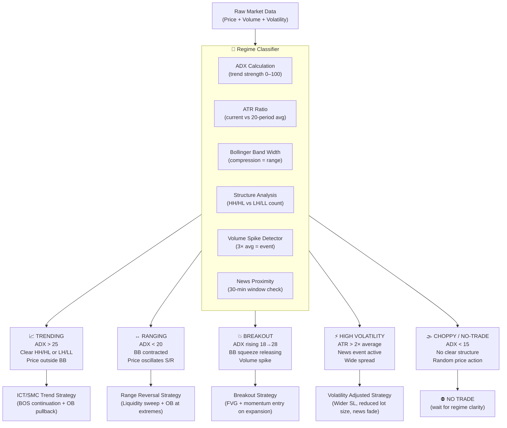

---

### Regime 1 — 📈 TRENDING MARKET

**Detection Criteria:**
- ADX > 25 (strong directional momentum)
- Clear HH + HL sequence (uptrend) or LH + LL sequence (downtrend)
- Price consistently outside the 20-period Bollinger Band mid-line
- EMA 20 > EMA 50 > EMA 200 (bullish stack) or reverse

**Strategy Activated: ICT/SMC Trend Continuation**
```
1. Identify the prevailing trend direction (D1/H4 BOS chain)
2. Wait for pullback INTO a valid Order Block or FVG
3. Confirm entry with CHoCH on M5/M15
4. Enter in the direction of the trend (BUY pullbacks in uptrend)
5. TP = next major liquidity pool (swing high/BSL)
6. SL = below OB low (tight, structure-based)
7. RR Target: minimum 1:2, ideal 1:3+
```

**Risk Parameters in Trending Regime:**
| Parameter | Value |
|-----------|-------|
| Risk per trade | 1% of equity |
| Max trades | 3 concurrent |
| Minimum RR | 1:2 |
| SL type | Structural (OB-based) |
| Trailing stop | Active after TP1 |

---

### Regime 2 — ↔️ RANGING MARKET

**Detection Criteria:**
- ADX < 20 (weak or no directional momentum)
- Price bouncing between identifiable Support and Resistance
- Bollinger Bands contracted (low bandwidth)
- ATR below 20-period average

**Strategy Activated: Liquidity Sweep + Range Reversal**
```
1. Map the range: identify clear Range High (RH) and Range Low (RL)
2. Mark liquidity pools ABOVE range high and BELOW range low
3. Wait for a SWEEP beyond range boundary (stop hunt move)
4. Confirm sweep with a rejection candle + M5 MSS in opposite direction
5. Enter FROM the sweep level BACK INTO the range
6. TP = opposite side of the range (Range High or Range Low)
7. SL = beyond the sweep wick high/low
8. RR Target: minimum 1:1.5 (range is finite, so targets are capped)
```

**Why This Works:** Institutions hunt stops beyond range boundaries before reversing. The sweep IS the signal.

**Risk Parameters in Ranging Regime:**
| Parameter | Value |
|-----------|-------|
| Risk per trade | 0.75% of equity (reduced — tighter range) |
| Max trades | 2 concurrent |
| Minimum RR | 1:1.5 |
| SL type | Beyond sweep wick |
| Trailing stop | Disabled (range-bound TP is fixed) |

---

### Regime 3 — 💥 BREAKOUT MARKET

**Detection Criteria:**
- ADX rising from < 20 toward > 25 (momentum building)
- Bollinger Band squeeze releasing (bandwidth expanding after compression)
- Volume spike > 2× 20-period average on the breakout candle
- Price closes convincingly above/below a major S/R or consolidation zone

**Strategy Activated: Momentum Breakout + FVG Retest**
```
1. Identify the compression zone (consolidation / inside bar cluster)
2. Wait for confirmed breakout candle (close beyond the zone)
3. Look for a Fair Value Gap (FVG) left by the breakout impulse
4. Enter on the RETEST of the FVG (price pulls back to fill gap)
5. SL = below the FVG low (breakout invalidated if price re-enters zone)
6. TP1 = 1× impulse height projected from FVG
7. TP2 = 2× impulse height (momentum continuation)
8. If no FVG retest within 3 candles → skip (no chase)
```

**Risk Parameters in Breakout Regime:**
| Parameter | Value |
|-----------|-------|
| Risk per trade | 1.25% of equity (higher reward potential) |
| Max trades | 2 concurrent (breakouts can reverse fast) |
| Minimum RR | 1:2 |
| SL type | FVG-based |
| Trailing stop | Aggressive (1× ATR trail after TP1) |

---

### Regime 4 — ⚡ HIGH VOLATILITY MARKET

**Detection Criteria:**
- ATR > 2× its 20-period average (abnormal volatility)
- High-impact news event active or within ±30 minutes
- Spread > 3× normal spread
- Price moving > 2× normal candle range per M5 candle

**Strategy Activated: News Fade / Volatility Reversion**
```
PHASE 1 — BEFORE EVENT (30-min window):
  → FREEZE all new entries (news filter active)
  → Manage existing positions: tighten SL, consider early partial close

PHASE 2 — DURING EVENT (spike candle):
  → Observe only. No trades during initial spike.
  → Measure: how far did price spike? Was a key level swept?

PHASE 3 — AFTER SPIKE (3–5 candles post-event):
  → Check if spike swept a major liquidity pool (BSL or SSL)
  → Check for immediate rejection candle (engulfing or pinbar)
  → If YES: fade the spike (trade in opposite direction of news spike)
  → SL = beyond spike wick extreme
  → TP = pre-news price level (mean reversion target)
  → Lot size REDUCED by 50% (compensates for wider SL)
```

**Risk Parameters in High-Volatility Regime:**
| Parameter | Value |
|-----------|-------|
| Risk per trade | 0.5% of equity (half normal — protect capital) |
| Max trades | 1 concurrent |
| Minimum RR | 1:1.5 |
| SL type | Wide (beyond spike wick) |
| Trailing stop | Disabled |

---

### Regime 5 — 🌫️ CHOPPY / NO-TRADE ZONE

**Detection Criteria:**
- ADX < 15 (directionless, random noise)
- No clear swing structure forming
- Price criss-crossing EMA 20 repeatedly
- ATR near multi-day lows (dead market)
- Typically: Sunday open, mid-Asian session, holiday periods

**Strategy Activated: WAIT**
```
→ Zero new entries
→ Continue managing open positions (trail stops, monitor SL)
→ Re-evaluate regime every 15 minutes
→ Log "CHOPPY" condition to dashboard
→ Notify via dashboard indicator that agent is on standby
```

**Why This Matters:** The most profitable thing a trading system can do in a choppy market is **nothing**. Forcing trades in noise is the #1 cause of drawdowns.

---

### Regime Transition Logic

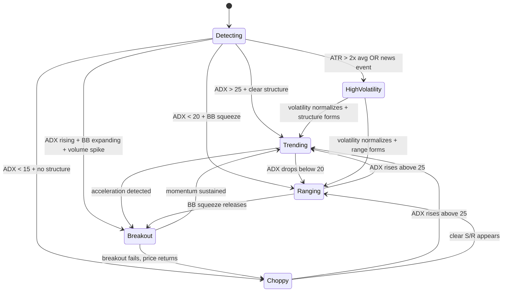

**Regime Stability Rule:** A regime must persist for **at least 3 consecutive H1 candles** before being confirmed. This prevents rapid false switches during transitional periods.

---

### Regime Display on Dashboard

The current regime is always visible on the dashboard as a live indicator:

```
┌────────────────────────────────────────────────┐
│  MARKET REGIME — EURUSD                        │
│  ████████░░  TRENDING (Bullish)   ADX: 32.4   │
│  Strategy: ICT/SMC Trend Continuation          │
│  Active since: 4h 23m                          │
│  Confidence: HIGH                              │
└────────────────────────────────────────────────┘
```

---

## 4. Multi-Timeframe Confluence Engine

The system uses a **top-down approach**. Higher timeframes ALWAYS override lower ones.

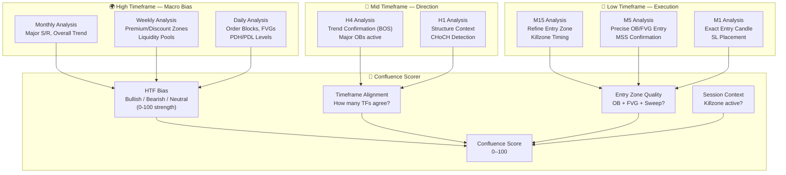

### The 3-Step Trade Story

Every valid trade must tell a clear **narrative** across 3 levels:

```
STEP 1 — MACRO BIAS (D1/W1)
  ✅ Price is in a daily DISCOUNT zone (below 50% of daily range)
  ✅ Daily trend is BULLISH (Higher Highs, Higher Lows)
  ✅ Untested Daily Order Block sitting below current price
  ✅ Major Buy-Side Liquidity pool sitting above

STEP 2 — CONTEXT (H4/H1)  
  ✅ H4 shows bullish BOS (broke above last H4 swing high)
  ✅ H1 shows CHoCH (shift from bearish to bullish structure)
  ✅ Price has swept SSL (sold off to grab stops below equal lows)
  ✅ H1 OB / FVG formed at the swept SSL area

STEP 3 — EXECUTION (M15/M5/M1)
  ✅ Price enters the H1 OB zone
  ✅ M5 shows MSS (micro bullish shift)
  ✅ M5 FVG formed inside H1 OB → enter at FVG 50% level
  ✅ SL: 2 pips below H1 OB low
  ✅ TP1: Previous H1 high (1:1.5 RR), TP2: Daily BSL (1:3 RR)

→ SIGNAL GENERATED ✅
```

---

## 5. AI Signal Generator — The Quant-First Hybrid Confidence Score

Every setup is evaluated using a **Hybrid Confidence Score** (out of 100). The mathematical/quantitative layer calculates structural setup quality, while the AI layer evaluates context. Only setups scoring **≥ 70** are traded.

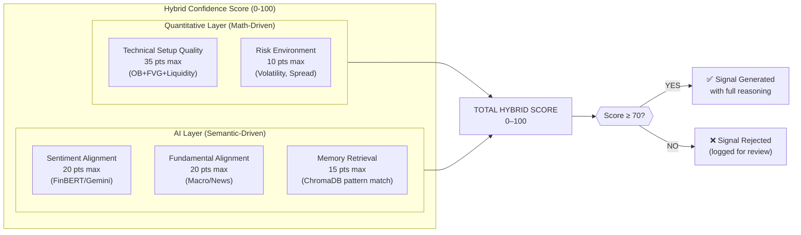

### Signal Output Structure

Every generated signal carries full context:

```json
{
  "id": "SIG_20260529_EURUSD_BUY_001",
  "timestamp": "2026-05-29T12:00:00Z",
  "symbol": "EURUSD",
  "direction": "BUY",
  "confidence": 84,
  "entry_price": 1.08450,
  "stop_loss": 1.08200,
  "take_profit_1": 1.08825,
  "take_profit_2": 1.09200,
  "risk_reward_1": 1.5,
  "risk_reward_2": 3.0,
  "timeframe_bias": {
    "daily": "BULLISH",
    "h4": "BULLISH",
    "h1": "BULLISH",
    "m15": "BULLISH"
  },
  "reasoning": [
    "D1 bullish trend: HH+HL pattern confirmed",
    "Price swept D1 SSL at 1.08150 (stop hunt complete)",
    "H1 Order Block at 1.08200–1.08450 (unmitigated)",
    "M5 FVG at 1.08350–1.08450 (entry zone)",
    "M5 MSS: bullish CHoCH confirmed at 1.08380",
    "London Kill Zone active (08:15 UTC)",
    "RSI bullish divergence on M15"
  ],
  "session": "LONDON",
  "kill_zone": true,
  "poi_type": "OB+FVG",
  "market_regime": "TRENDING",
  "active_strategy": "ICT_SMC_TREND_CONTINUATION",
  "regime_adx": 32.4,
  "regime_confidence": "HIGH",
  "regime_active_since": "4h 23m",
  "htf_score": 30,
  "liquidity_score": 20,
  "poi_score": 20,
  "session_score": 15,
  "indicator_score": 7,
  "volume_score": 5
}
```

---

## 6. Risk Manager — Capital Preservation

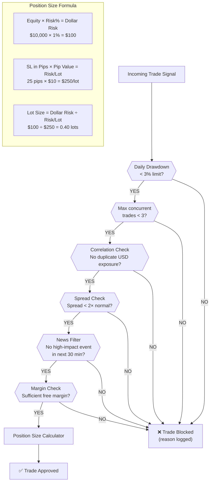

### Position Lifecycle Management

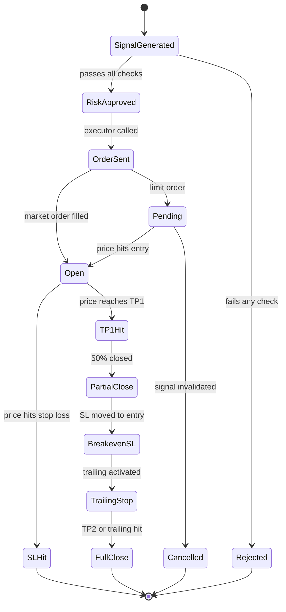

---

## 7. Trade Executor — Order Flow

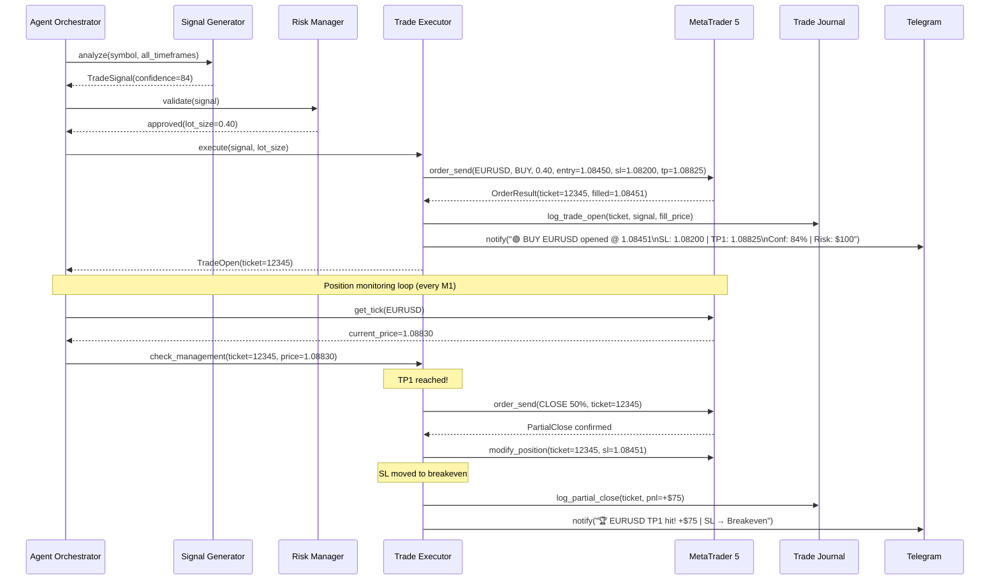

---

## 8. Agent Orchestrator — The Main Loop

This is the **heartbeat** of the entire system. Runs every M1 candle close.

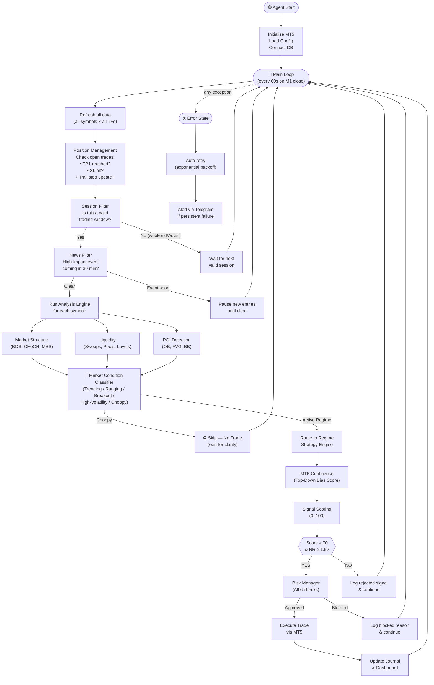

---

## 9. Backtesting Engine — Strategy Validation

Before any strategy goes live, it's validated through the backtesting engine.

```mermaid
flowchart LR
    subgraph INPUT["Input"]
        HIST["Historical Data\n(MT5 or CSV)"]
        CFG["Strategy Config\n(params, thresholds)"]
        RANGE["Date Range\n(e.g. 2022–2025)"]
    end

    subgraph ENGINE["Backtesting Engine"]
        SIM["Event Simulator\n(candle-by-candle replay)"]
        ANA["Analysis Engine\n(same as live)"]
        FILL["Order Fill Simulator\n(spread + slippage)"]
        TRACK["Position Tracker\n(SL/TP management)"]
    end

    subgraph METRICS["Performance Metrics"]
        WR["Win Rate %"]
        PF["Profit Factor\n(GrossWin / GrossLoss)"]
        SR["Sharpe Ratio"]
        DD["Max Drawdown %"]
        RR["Avg RR Ratio"]
        EXP["Statistical Expectancy\n(WR × AvgWin) - (LR × AvgLoss)"]
        WFV["Walk-Forward\nValidation\n(prevent overfitting)"]
    end

    INPUT --> ENGINE
    ENGINE --> METRICS
    METRICS --> REPORT["JSON Report\n→ Dashboard Backtest Lab"]
```

### Walk-Forward Validation

```
Full Data: 2022–2025 (3 years)
  ├── Optimize on: 2022–2024 (in-sample)  
  └── Validate on: 2024–2025 (out-of-sample)
      → If out-of-sample performance degrades > 30%, strategy rejected
      → If stable → approved for live paper trading
      → After 90 days paper trading profitable → approved for live
```

---

## 10. FastAPI Backend — API Structure

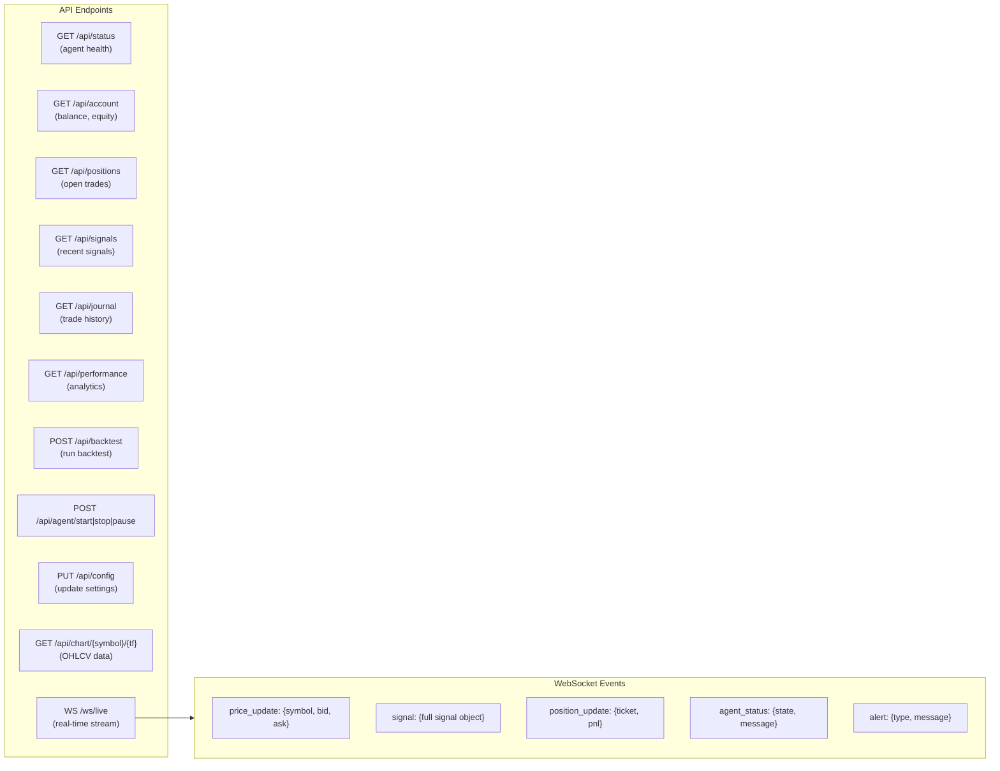

---

## 11. React Dashboard — UI Architecture

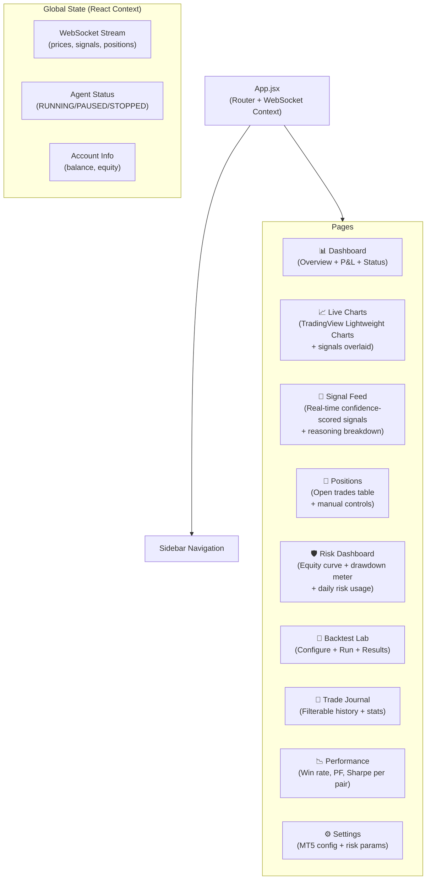

---

## 12. Database Schema — Trade Journal (SQLite)

```
┌─────────────────────────────────────────────────────────────┐
│ TABLE: trades                                               │
├─────────────────┬───────────────┬────────────────────────── │
│ id              │ INTEGER PK    │ Auto-increment             │
│ ticket          │ INTEGER       │ MT5 order ticket           │
│ signal_id       │ TEXT          │ Link to signal             │
│ symbol          │ TEXT          │ e.g. EURUSD                │
│ direction       │ TEXT          │ BUY / SELL                 │
│ open_time       │ DATETIME      │ Trade open timestamp       │
│ close_time      │ DATETIME      │ Trade close timestamp      │
│ entry_price     │ REAL          │ Actual fill price          │
│ exit_price      │ REAL          │ Close price                │
│ stop_loss       │ REAL          │ Initial SL                 │
│ take_profit_1   │ REAL          │ TP1 level                  │
│ take_profit_2   │ REAL          │ TP2 level                  │
│ lot_size        │ REAL          │ Position size              │
│ pnl             │ REAL          │ Realized P&L in $          │
│ pips            │ REAL          │ Pips gained/lost           │
│ confidence      │ INTEGER       │ Signal score (0–100)       │
│ session         │ TEXT          │ LONDON/NY/ASIAN            │
│ close_reason    │ TEXT          │ TP1/TP2/SL/MANUAL/TRAIL    │
│ reasoning       │ JSON          │ Full signal reasoning      │
└─────────────────────────────────────────────────────────────┘

┌─────────────────────────────────────────────────────────────┐
│ TABLE: signals                                              │
├─────────────────┬───────────────┬───────────────────────────│
│ All signal fields (id, timestamp, symbol, score,           │
│  direction, entry, sl, tp1, tp2, status, rejected_reason)  │
└─────────────────────────────────────────────────────────────┘

┌─────────────────────────────────────────────────────────────┐
│ TABLE: daily_stats                                          │
├──────────────────────────────────────────────────────────── │
│ date, starting_equity, ending_equity, daily_pnl,           │
│ daily_drawdown, trades_taken, win_count, loss_count        │
└─────────────────────────────────────────────────────────────┘
```

---

## 13. End-to-End Trade Example — XAUUSD (Gold)

**Scenario**: It's 08:05 UTC (London Kill Zone). Gold is in a daily uptrend.

```
⏰ 08:00 UTC — M1 candle closes

STEP 1 — DATA REFRESH
  └── Fetches latest OHLCV for XAUUSD on all TFs

STEP 2 — MARKET STRUCTURE ANALYSIS
  ├── D1: Bullish trend (HH+HL), last BOS at $2,280
  ├── H4: Bullish BOS confirmed, price above H4 OB
  ├── H1: Price swept SSL at $2,305 (grabbed stops below equal lows)
  └── H1 CHoCH detected at $2,308 (shift to bullish)

STEP 3 — LIQUIDITY & POI
  ├── SSL swept at $2,305 → stop hunt complete ✅
  ├── H1 Order Block identified: $2,305–$2,312
  ├── M15 FVG inside OB: $2,307–$2,310
  └── BSL (Buy-Side Liquidity) pool sitting at $2,340 (equal highs)

STEP 4 — CONFLUENCE SCORING
  ├── HTF Bias (D1+H4+H1 all bullish): 30/30 pts
  ├── Liquidity Sweep (SSL swept): 20/20 pts
  ├── POI Quality (OB + FVG overlap): 20/20 pts
  ├── Session (London Kill Zone active): 15/15 pts
  ├── Indicators (M15 RSI divergence): 5/10 pts
  └── Volume (spike at sweep): 5/5 pts
  → TOTAL: 95/100 ✅ (Well above 70 threshold)

STEP 5 — SIGNAL GENERATED
  ├── Direction: BUY
  ├── Entry: $2,308 (FVG 50% level)
  ├── Stop Loss: $2,303 (2 pips below OB low)
  ├── TP1: $2,323 (RR 1:3) — previous M1 structure high
  └── TP2: $2,340 (RR 1:6.4) — BSL pool

STEP 6 — RISK MANAGEMENT
  ├── Account Equity: $10,000
  ├── Risk: 1% = $100
  ├── SL Distance: $2,308 - $2,303 = $5 = 50 pips (Gold)
  ├── Pip Value (XAUUSD 0.01 lot): $0.01/pip
  ├── Lot Size: $100 / (50 × $1.00) = 0.10 lots
  └── All 6 checks: PASSED ✅

STEP 7 — EXECUTION
  ├── MT5 order sent: BUY 0.10 XAUUSD @ $2,308
  ├── Filled @ $2,308.2 (0.2 pip slippage)
  ├── Journal entry created
  └── Telegram: "🟡 BUY GOLD opened @ $2,308.2 | Conf: 95%"

STEP 8 — POSITION MANAGEMENT (ongoing)
  ├── Price reaches $2,323 (TP1) → Close 0.05 lots, +$75
  ├── SL moved to $2,308.2 (breakeven — risk-free)
  ├── Trailing stop activated (trails 1.5× ATR below price)
  ├── Price reaches $2,340 (TP2) → Close remaining 0.05 lots, +$160
  └── Total P&L: $235 | RR achieved: 1:4.7

JOURNAL LOGGED ✅ | PERFORMANCE UPDATED ✅
```

---

## 14. Security & Reliability

| Concern | Solution |
|---------|----------|
| **Credential Security** | MT5 credentials in `.env` file, never in code |
| **MT5 Disconnection** | Auto-reconnect with exponential backoff, Telegram alert |
| **Runaway trades** | Daily drawdown kill-switch (auto-stop at 3% loss) |
| **Overfitting** | Walk-forward validation before any live deployment |
| **Spread spikes** | Spread monitor blocks entries if spread > 2× normal |
| **News events** | Calendar API blocks entries 30 min before high-impact |
| **Power/crash** | SQLite journal persists state; agent resumes on restart |
| **Over-trading** | Max 3 concurrent trades hard limit |
| **Correlation** | No 2 USD-correlated pairs open simultaneously |
| **Choppy markets** | Classifier detects ADX < 15 → zero entries, agent stands by |
| **Strategy mismatch** | Regime classifier prevents trend strategy firing in ranging market |
| **Volatility spikes** | High-vol regime halves lot size and freezes entries during news |

---

## 15. Technology Stack Summary

| Layer | Technology | Purpose |
|-------|-----------|---------|
| **Broker API** | MetaTrader5 (Python lib) | Market data + order execution |
| **Data Processing** | Pandas, NumPy | OHLCV manipulation, resampling |
| **SMC Analysis** | smartmoneyconcepts | OB, FVG, BOS, CHoCH detection |
| **Indicators** | pandas-ta | ATR, RSI, MACD, EMA |
| **Backend** | FastAPI + Uvicorn | REST API + WebSocket server |
| **Scheduling** | APScheduler | M1 loop, session management |
| **Database** | SQLite + SQLAlchemy | Trade journal, signals log |
| **Frontend** | React + Vite | Dashboard UI |
| **Charts** | TradingView Lightweight Charts | Candlestick + signal overlays |
| **Analytics Charts** | Recharts | Equity curve, P&L, win rate |
| **Notifications** | python-telegram-bot | Trade alerts |
| **Environment** | python-dotenv | Secure config management |
| **Regime Detection** | pandas-ta (ADX, ATR, BB) + custom logic | Market condition classification |
| **Multi-Strategy** | Strategy Router (custom) | Routes signals by regime (Trending/Ranging/Breakout/HV/Choppy) |
